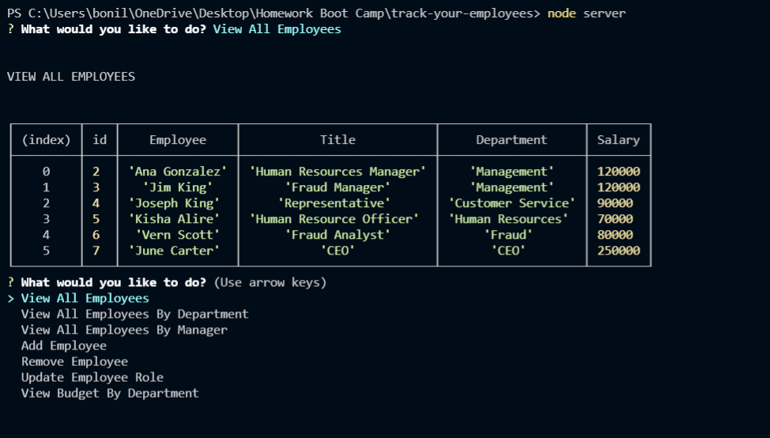

# track-your-employee

  
  
  ## Description
  This project allows for an individual to review all employees within their company. They can also add new employees, update existing employees and remove employees.

  

  ## Table of Contents

  * [Installation](#installation)
  * [Usage](#usage)
  * [Contributing](#contributing)
  * [Tests](#tests)
  * [License](#license)
  * [Questions](#questions)

  ## Installation

  Please install the following dependances:

  inquirer, mysql, and console.table

  ## Usage

  Individual will need to utilze node.js to run program

  ## Contributing

  inquirer, mysql, and console.table

  ## Tests
  
  Tests can be run using the following:
  None

  ## License
  
  This is licensed under MIT.
  
  ## Questions

  Questions about this repository? Please contact the owner at [bonilhav@gmail.com](mailto:bonilhav@gmail.com). View more work from the owner in GitHub at [bonilhav](https://github.com/bonilhav)
